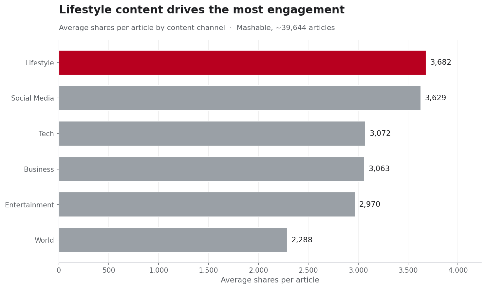
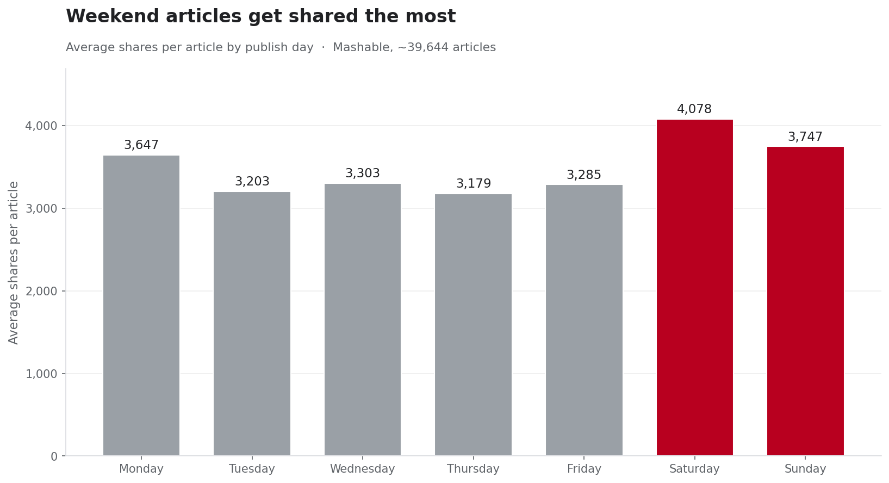

# Content Engagement Analysis

**What actually makes an article get shared — the writing, or something else?**

I kept running into two opposite pieces of advice about online content: "make it longer and more detailed" versus "keep it short and punchy." Both camps were arguing about the article itself. So I wanted to check whether the article is even the thing that decides how far a story travels. I pulled ~39,644 articles from Mashable (the UCI Online News Popularity dataset) and worked through it in three layers.

## The question

Given everything we can measure about an article — its length, how many links and images it has, how subjective the writing is, what topic it covers, and when it went out — which of those actually move share counts? And which ones do we just *assume* matter?

## How I approached it

I built the analysis in three layers, working from the most obvious lever to the least obvious:

1. **The content itself** — word count, links, images, subjectivity
2. **The channel** — the topic category the article belongs to
3. **The timing** — the day of the week it was published

Each layer is a section in the notebook with the numbers behind it. The two findings that mattered most are charted below.

## Layer 1 — The writing barely moves the needle

This was the surprise. Every "craft" feature I tested came back with a correlation to shares below 0.05: links, images, how subjective or opinionated the writing was, and the article's length. Longer articles didn't reliably get shared more. Neither did image-heavy ones. The thing most people obsess over turned out to be the weakest predictor in the whole dataset.

## Layer 2 — Channel is where the real gap lives

When I grouped by content channel, the spread was hard to ignore.

| Channel | Articles | Avg shares |
|---|---:|---:|
| Lifestyle | 2,099 | 3,682 |
| Social Media | 2,323 | 3,629 |
| Tech | 7,346 | 3,072 |
| Business | 6,258 | 3,063 |
| Entertainment | 7,057 | 2,970 |
| World | 8,427 | 2,288 |

Lifestyle articles averaged about 61% more shares than World articles. And here's the part I didn't expect: World had the *most* articles in the dataset (8,427) but the lowest average shares, while Lifestyle had the *fewest* (2,099) and the highest. More volume in a category doesn't translate to more reach per story — if anything, the busiest channel was the least rewarded per article.

## Layer 3 — Weekends win

Timing mattered too, just less dramatically than channel.

| Day | Avg shares |
|---|---:|
| Saturday | 4,078 |
| Sunday | 3,747 |
| Monday | 3,647 |
| Wednesday | 3,303 |
| Friday | 3,285 |
| Tuesday | 3,203 |
| Thursday | 3,179 |

Saturday articles averaged about 28% more shares than Thursday ones. Weekend publishing led the week, with Monday holding on as a strong third. The mid-to-late week — Tuesday through Thursday, when most outlets push the most content — sat at the bottom.

## So what

If I were handing this to a content team, the takeaway would be uncomfortable but useful: you can polish an article all you want, but the two biggest levers you actually control are **what you cover** and **when you post it**. A well-timed Lifestyle piece on a Saturday starts from a structurally higher ceiling than a Thursday World story, before a single word is written. The craft still matters for whether a reader finishes the piece — it just isn't what decides whether they pass it on.

## How it was built

- **Python** (pandas) for cleaning and analysis
- **Matplotlib** for the two charts
- **SQLite** (via `sqlite3`) to load the cleaned data and run the channel and day queries — see `queries.sql`
- **Excel** for the summary workbook
- ~39,644 articles, Mashable Online News Popularity dataset (UCI Machine Learning Repository)

## What's in this repo

| File | What it is |
|---|---|
| `content-analysis.ipynb` | The full analysis notebook |
| `OnlineNewsPopularity_CLEANED.csv` | Cleaned dataset |
| `channel_shares.png` / `dayofweek_shares.png` | The two charts |
| `content_engagement.db` | SQLite database |
| `queries.sql` | The SQL queries |
| `content_engagement_summary.xlsx` | Three-sheet Excel summary |
